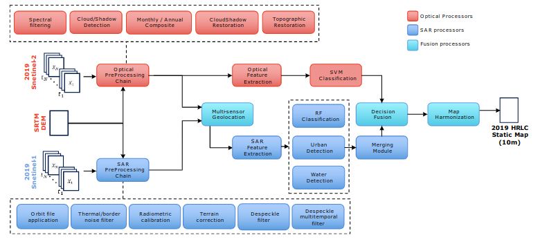
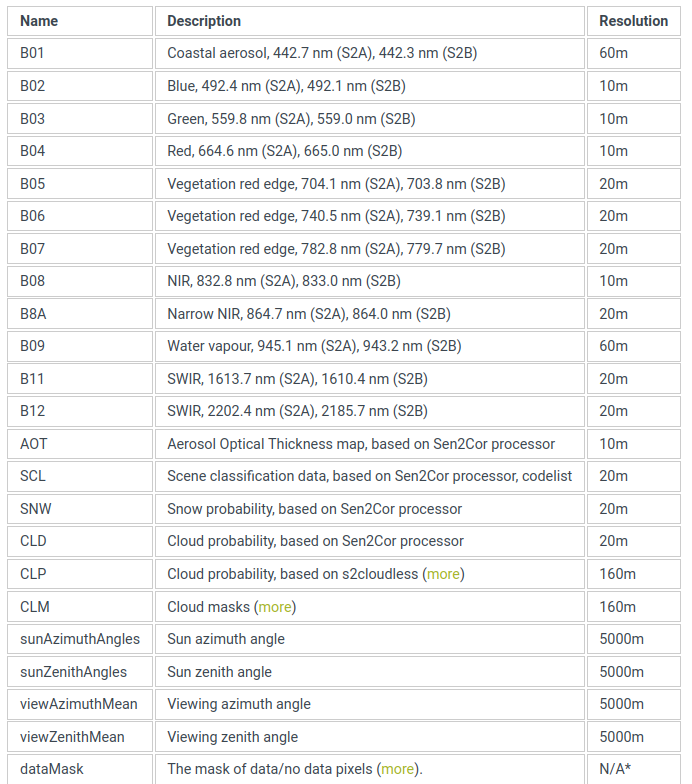
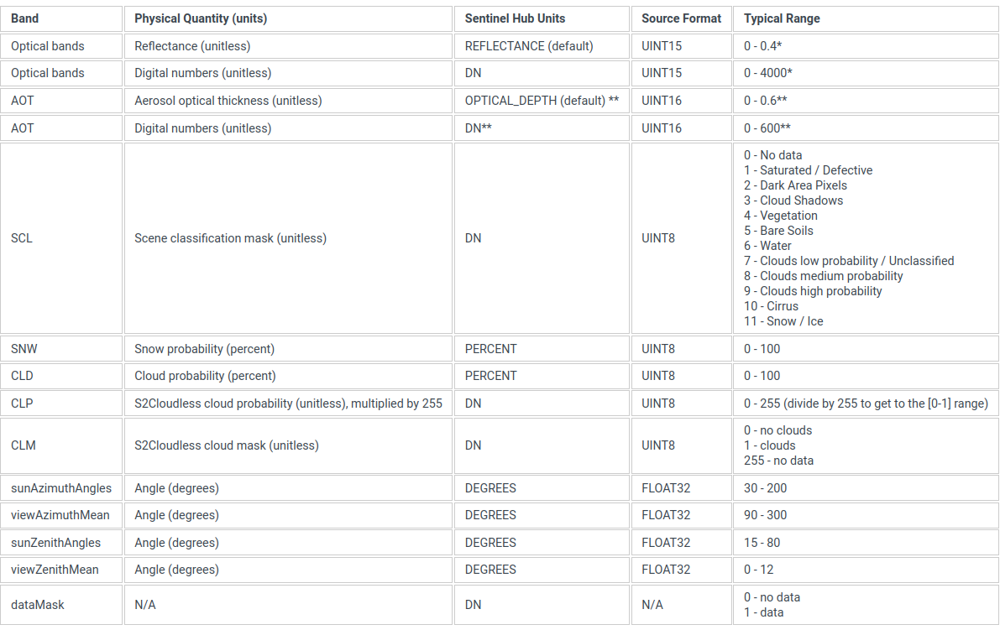

# CCI HRLC Processing Chain Review

## Overview
This repository contains code for the processing of multispectral remote sensing images time series to produce land cover maps for climate change-related applications. The project is conducted as part of the 'Sensing and Radar Technologies' and 'Project Course' modules, for a total of 12 CFU.

The details of each of the previous pipeline are at [document](doc/CCI_HRLC_Ph1-D2.2_ATBD_v4.0.pdf) and the image below shows, in red, the parts of the pipeline involved in this project.



Read the report [here](doc/ARSS_report.pdf) for a detailed description of the project and the results.

### Component description

The development of this repository builds upon a previous version of the processing pipeline for generating land cover maps. The existing shared pipeline consists of seven sequential steps, each implemented as a standalone script:
1. **Image selection**: Selects and filters input images for processing ([script](doc/0.raw_scripts/1.selectImages.py)).
2. **Spectral filtering**: Applies multispectral filters to enhance data quality ([script](doc/0.raw_scripts/2.opt-spectral-filtering.py)).
3. **Cloud and Shadow masks refinement**: Refines sen2cor cloud and shadow masks of Sentinel L2A products ([script](doc/0.raw_scripts/3.opt-cloud-detection.py)).
4. **Composites generation**: Produces seasonal composites from the filtered images ([script](doc/0.raw_scripts/4.opt-sesonal-composite.py)).
5. **Cloud restoration**: Restores data obscured by cloud cover ([script](doc/0.raw_scripts/5.cloudRestore.py)).
6. **SVM training**: Trains a Support Vector Machine (SVM) classifier using GLCM (Gray Level Co-occurrence Matrix) features ([script](doc/0.raw_scripts/6.svm_opt_train_glcm_final.py)).
7. **SVM classification**: Applies the trained SVM model for land cover classification ([script](doc/0.raw_scripts/7.svm_svm_opt_classify_final.py)).

## Repository structure

This repository follows the standard RSLab template for Python projects. It employs Docker to create a containerized environment, ensuring all necessary components are available to run each script in the pipeline. Below is a brief explanation of the repository's folders and their contents:

### Folder Descriptions

- **doc**: Contains supporting materials for the project:
    - raw scripts: The original, unaltered scripts provided at the start of the project.
    - resources: External resources downloaded and used during development.
    - slides: Course slides relevant to the project's objectives.

- **notebook**: Includes a notebook for each step of the pipeline. These notebooks:

    - Facilitate user-friendly testing of the developed components.
    - Provide tools to generate reports and visualizations for data produced at each pipeline step.
    - Enable inspection of results, such as image outputs or experiment metrics from SVM-related steps.
    - Include functionalities like report generation and plotting, offering insights into the pipeline's performance and outputs.

- **scripts/config_files**: Contains configuration files for each pipeline step, each contain all the parameters necessary to configure each part of the pipeline.

- **scripts/rs_queue**: Contains .sh scripts for running pipeline scripts through the RSLab queue system.

- **src**: The core implementation of the project's functions. This code is used by the scripts and is also used within the notebooks.

### Additional Notes

- **Special Notebooks**:

    - *download_s2_data* ([notebook](notebook/download_s2_data.ipynb)): A user-friendly notebook for automatically identifying and downloading Sentinel-2 products. These products can be used for masks refinement or other purposes.
    - *evaluate_methods* ([notebook](notebook/evaluate_methods.ipynb)): Uses the CloudSen12+ dataset to evaluate the adopted masks refinement methods.

- **Notebooks vs. Scripts**: Notebooks mirror the main logic of the scripts, but offer enhanced visualization and interactivity, making them ideal for components mechanisms inspection.

- **Band correspondance in composites**

This mapping was used to organize composites bands. The third columns rapresents the band index inside the composites GeoTIFF files used for this project.

| Sentinel-2 Bands | Desc. | Composite Bands labels |
|----------|----------|----------|
| B01 | Costal aereosol  | 11 | 
| B02 | Blue  | 3 |
| B03 | Green | 2 |
| B04 | Red | 1 |
| B05 | Veg. red edge 704.5 nm | 5 |
| B06 | Veg. red edge 740.5 nm | 6 |
| B07 | Veg. red edge 833.0 nm | 7 |
| B08 | NIR | 4 |
| B8A | Narrow NIR | 8 |
| B09 | Water vapour | 12 |
| B11 | SWIR 1613.7 nm | 9 |
| B12 | SWIR 2202.4 nm | 10 |

## How do I get set up? ###

### Scripts execution
1. Deploy the docker container with: 
```bash 
bash launch_docker.sh arss-srt v1.0.0
```
2. Inspect [configuration files](scripts/config_files/) to setup properly the parameters of the scripts that will be executed.
3. Execute the script directly or though the queue.

```bash
Direct execution

docker exec -t arss-srt_lucazanolo masks-refinement -c luca-zanolo/scripts/config_files/1.masks_refinement.yaml
docker exec -t arss-srt_lucazanolo cloud-restoration -c luca-zanolo/scripts/config_files/3.cloud_restoration.yaml
docker exec -t arss-srt_lucazanolo process-features -c luca-zanolo/scripts/config_files/4.generate_features.yaml
docker exec -t arss-srt_lucazanolo generate-dataset -c luca-zanolo/scripts/config_files/5.generate_dataset.yaml
docker exec -t arss-srt_lucazanolo svm-pipeline -c luca-zanolo/scripts/config_files/6.svm_pipeline.yaml
docker exec -t arss-srt_lucazanolo generate-lc-map -c luca-zanolo/scripts/config_files/7.generate_lc_map.yaml
```

```bash
RSLab queue execution (command to be runned inside scripts/rs_queue/ folder)

cd scripts/rs_queue

rs_qsub.sh arss-srt-mskref 2:00:00 bash 1.masks_refinement.sh
rs_qsub.sh arss-srt-cldres 2:00:00 bash 3.cloud_restoration.sh
rs_qsub.sh arss-srt-glcmft 2:00:00 bash 4.generate_features.sh 
rs_qsub.sh arss-srt-gendts 2:00:00 bash 5.generate_dataset.sh 
rs_qsub.sh arss-srt-svmpip 2:00:00 bash 6.svm_pipeline.sh 
rs_qsub.sh arss-srt-glcmap 2:00:00 bash 7.generate_lc_map.sh 
```

#### Notebooks execution

1. Create the python environment with:
```bash
bash notebook/venv_for_notebook/create_venv.sh
```
2. Use the notebooks

## Useful commands
### Disk usge

- See disks usage: 
```bash
df -h
```
- See specific disk usage: 
```bash
du -sh <path>
```
### RSLab queue

- See jobs in queue:
```bash
rs_qstat.sh
```
- Delete a job:
```bash
rs_qdel.sh JOBID
```

## Other information

### Sentinel- 2 Products Information

This guide provides a detailed overview of the Sentinel-2 SAFE folder structure, explaining the purpose of each file and directory within the archive.

#### Overview of the SAFE Format

The Sentinel-2 data is delivered in a format known as **SAFE** (Standard Archive Format for Europe). This format organizes the data into various directories and files, making it easier to manage and process.

#### Key Components of the SAFE Format

1. **Root Directory**
   - **`manifest.safe`**: This is the main index file of the SAFE package. It is an XML file that contains metadata about the product, including information about the data acquisition, the satellite platform, and the processing level. It also lists all files included in the package.
   
   - **`MTD_MSIL2A.xml`**: This file is the main metadata file for the Level-2A product. It contains detailed information about the product, such as processing parameters, geolocation of the tiles, and data quality. It also includes descriptions of the available bands and their respective resolutions.
   
   - **`INSPIRE.xml`**: This file contains metadata required by the European INSPIRE directive (Infrastructure for Spatial Information in the European Community). It ensures that the data complies with EU spatial data infrastructure standards.

2. **`GRANULE/` Directory**
   - **Purpose**: The `GRANULE` directory contains the actual image data (the spectral bands) and additional metadata. Each subdirectory within `GRANULE` corresponds to a specific granule, which is a geographical subset of the full scene covered by the satellite.
   
   - **Subdirectories and Files**:
     - **`<Granule ID>/`**: This directory is named based on the granule's unique identifier and contains the following important subdirectories and files:
       
       - **`IMG_DATA/`**: 
         - This subdirectory contains the image data in `.jp2` format (JPEG2000). The files here represent different spectral bands at varying resolutions.
         - **Example Files**:
           - `T42WXS_20190731T065629_B08_10m.jp2`: Near-Infrared band at 10-meter resolution.
           - `T42WXS_20190731T065629_B04_10m.jp2`: Red band at 10-meter resolution.
           - `T42WXS_20190731T065629_TCI_10m.jp2`: True color image composite at 10-meter resolution.
         - **Resolutions**:
           - **`R10m/`**: Contains bands at 10-meter resolution.
           - **`R20m/`**: Contains bands at 20-meter resolution.
           - **`R60m/`**: Contains bands at 60-meter resolution.
       
       - **`AUX_DATA/`**: 
         - This subdirectory contains auxiliary data, such as atmospheric correction parameters and other supplemental data required for processing.
       
       - **`QI_DATA/`**: 
         - Quality Indicators (QI) are stored here, including masks such as cloud probability masks, snow probability masks, and other quality flags. These files are crucial for quality control in data analysis.
         
         - **Example Files**:
           - `MSK_CLDPRB_20m.jp2`: Cloud probability mask at 20-meter resolution.
           - `MSK_SNWPRB_60m.jp2`: Snow probability mask at 60-meter resolution.
           - `MSK_NODATA_B04.gml`: No data mask for band B04.
       
       - **`MTD_TL.xml`**: 
         - Metadata specific to the tile (granule). It contains information about the acquisition, the granule's geolocation, and the sensor parameters used.

3. **`DATASTRIP/` Directory**
   - **Purpose**: The `DATASTRIP` directory contains metadata and quality information for the entire data strip (which may include multiple granules). It includes details about the satellite's attitude and orbit, as well as data quality indicators.
   
   - **Subdirectories and Files**:
     - **`<Data Strip ID>/`**: This directory is named after the unique identifier for the data strip and contains the following:
     
       - **`MTD_DS.xml`**: 
         - Metadata specific to the data strip, including information about the acquisition, processing, and overall quality of the data strip.
       
       - **`QI_DATA/`**: 
         - Quality indicators for the entire data strip, similar to those in the `GRANULE` directory but at a higher level.
         
         - **Example Files**:
           - `GENERAL_QUALITY.xml`: Overall quality report for the data strip.
           - `FORMAT_CORRECTNESS.xml`: Format correctness report ensuring data integrity.
           - `SENSOR_QUALITY.xml`: Sensor quality report assessing the performance of the satellite sensors.

#### Practical Use of Sentinel-2 SAFE Data

1. **Image Data Processing**:
   - Use the `.jp2` files in the `IMG_DATA/` directories for your analysis. These files contain the raw spectral bands necessary for various types of remote sensing analyses, such as vegetation monitoring, land use classification, and water quality assessment.

2. **Metadata Analysis**:
   - Parse the XML metadata files (`MTD_MSIL2A.xml`, `MTD_TL.xml`, `MTD_DS.xml`) to obtain crucial information about the data, including the geospatial reference, acquisition time, sensor details, and processing parameters.

3. **Quality Control**:
   - Apply the masks from the `QI_DATA/` directory to filter out areas affected by clouds, snow, or other quality issues. These masks are essential for ensuring that your analysis is based on the highest quality data available.

By understanding the structure and purpose of each file and directory in the Sentinel-2 SAFE package, you can effectively manage and process the satellite data for your remote sensing projects.

### Sentinel 2 bands informations





### Landsat and Sentinel-2 file names intepretation

#### Landsat
Available since 90'. Used its data until 2015 when Sentinel 2 was launched.
Offer images 2 images per month at 30m resolution in time range 90'-2015.

##### Dataset example:
1. LE07_L2SP_166052_20060327_20200914_02_T1_orig

##### Description:
- **LE07** - Landsat identifier. Available are 5,7,8 (6 launched and crashed)
- **L2** - Level 2 data processing (Surface reflectance data -> athmosferically correct)
- **SP** - Standard Processing: processing type to obtain these data.
- **166** - Satellite ground track, orbit path.
- **052** - Row number, specific section along the path.
- **20060327_20200914** - Acquisition and processing dates, respectively.
- **02** - Processing version.
- **T1** - Tier 1 data. Highest quality data.

#### Sentinel 2
Launched in 2015. Has a resolution of 10m in time range 06/2015 - Now.

##### Dataset examples:

1. S2B_MSIL2A_20190731T065629_N0213_R063_T42WXS_20190731T120318
2. S2A_MSIL2A_20190719T070631_N0213_R106_T42WXS_20190719T102226

##### Description
- **S2B/S2A**: satelline platform that acquire the image (Sentinel mission has 2 satellites, Sentinel 2A and 2B)
- **MSI**: specify the instrument name (Multi Spectral Imager -> Capture multispectral images)
- **L2A**: Processing level. Images to the ground with an SCL ( Scene classification layer) band, a classification map that classify different entities (cloud with high/med/low prob, cirrus, ...).

- **20190731T065629** or **20190719T070631**: Acquisition date and time
- **20190731T120318** or **20190719T102226**: Date and time of acquisition processing (L2)
- **N0213**: Processing program (Sen2Cor) version. Sen2Cor is a toolbox for processing Sentinel data, also used for producing masks.
- **R063** or **R106**: Orbit identifier.
- **T42WXS**: Universal grid cell identifier. Id used to identify cells on planet of 100x100 km.

